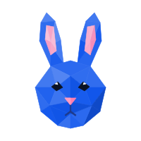
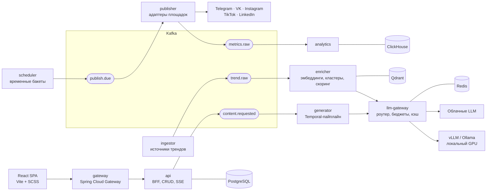

<p align="center">
  
</p>

<h1 align="center">Rabbot</h1>

<p align="center">
  <b>ИИ-автопилот для соцсетей:</b> находит тренды, пишет посты и Reels в стиле вашего бренда и публикует их по расписанию.<br>
  Локальные LLM на вашем GPU + облачные модели там, где нужно качество.
</p>

<p align="center">
  
  
  
  
  
  
  
  
</p>

---

## Содержание

- [Что умеет](#что-умеет)
- [Архитектура](#архитектура)
- [Ключевые инженерные решения](#ключевые-инженерные-решения)
- [Стек](#стек)
- [Структура репозитория](#структура-репозитория)
- [Быстрый старт](#быстрый-старт)
- [Роутинг моделей](#роутинг-моделей)
- [Нагрузка и надёжность](#нагрузка-и-надёжность)
- [Наблюдаемость](#наблюдаемость)
- [Дизайн](#дизайн)
- [Roadmap](#roadmap)
- [Architecture Decision Records](#architecture-decision-records)
- [Лицензия](#лицензия)

## Что умеет

| | Возможность | Как |
|---|---|---|
| 📈 | **Поиск трендов** | RSS, Hacker News, Reddit, YouTube, Яндекс Wordstat → дедупликация по эмбеддингам → кластеры → скоринг по росту и близости к бренду |
| ✍️ | **Контент в стиле бренда** | Профиль бренда (тон, аудитория, запрещённые слова) + RAG по лучшим постам бренда + LLM-судья, который проверяет текст перед публикацией |
| 🎬 | **Reels и клипы** | Сценарий по сценам, субтитры (Whisper локально), рендер 9:16 через FFmpeg, отдельные подписи и обложки для Instagram, TikTok и VK |
| 🗓️ | **Публикация по расписанию** | Контент-календарь, очередь одобрения, публикация в Telegram, VK, LinkedIn, Instagram, TikTok без дублей и с ретраями |
| 🧠 | **Гибрид LLM** | Массовые задачи (эмбеддинги, дедуп, саммари, черновики) идут на локальный GPU через vLLM/Ollama, финальный текст в облачную модель; бюджеты и fallback |
| 📊 | **Аналитика** | Метрики постов в ClickHouse, обратная связь в скоринг трендов и в примеры стиля |
| 🔐 | **Мультитенантность** | Бренды, роли и SSO через Keycloak, токены соцсетей зашифрованы в Vault |

## Архитектура



Сервисы разделены **по профилю нагрузки**, а не по сущностям: каждый масштабируется независимо через KEDA по лагу Kafka.

| Сервис | Ответственность | Масштабирование |
|---|---|---|
| `gateway` | OIDC, rate limit по тенанту | HPA по RPS |
| `api` | BFF, CRUD, одобрение, SSE-статусы | HPA по CPU |
| `ingestor` | Адаптеры источников трендов | KEDA |
| `enricher` | Эмбеддинги, дедуп, кластеризация, скоринг | KEDA по лагу |
| `generator` | Пайплайн генерации на Temporal | KEDA по очереди Temporal |
| `llm-gateway` | Роутинг моделей, бюджеты, семантический кэш, маскирование ПДн | HPA |
| `scheduler` | Временные бакеты → `publish.due` | Шарды по `tenant_id` |
| `publisher` | Публикация, rate limits площадок, идемпотентность | KEDA по лагу |
| `analytics` | Сбор метрик → ClickHouse | KEDA |

## Ключевые инженерные решения

- **Transactional outbox.** Статус в PostgreSQL и событие в Kafka не могут разойтись.
- **Публикация ровно один раз по эффекту.** Ключ идемпотентности на каждую попытку и проверка `external_id` у площадки перед ретраем.
- **Планировщик на временных бакетах** (`FOR UPDATE SKIP LOCKED`) вместо Quartz: масштабируется до миллионов отложенных постов.
- **Сглаживание пиков.** Время «9:00» превращается в окно с джиттером, а медиа загружаются на площадку заранее.
- **Распределённые rate limits.** Bucket4j + Redis по ключу `площадка + токен`.
- **LLM-роутер.** Задача → модель → fallback задаются в конфиге; при превышении бюджета работает только локальная модель.
- **Pull-модель для GPU-воркера.** Воркер сам забирает задачи из очереди, поэтому домашнему GPU не нужен белый IP.
- **Java 25.** Виртуальные потоки для тысяч одновременных вызовов внешних API, Generational ZGC, AOT cache для быстрого старта подов.

## Стек

| Слой | Технологии |
|---|---|
| Backend | Java 25, Spring Boot 4, Spring Modulith, Spring AI, Spring Kafka, Spring Cloud Gateway, Resilience4j, Bucket4j, Flyway |
| Оркестрация | Temporal |
| LLM | vLLM, Ollama, TEI (bge-m3), облачные модели через Spring AI |
| Медиа | FFmpeg, Whisper |
| Данные | PostgreSQL (CloudNativePG), Qdrant, ClickHouse, Redis, MinIO / S3 |
| Шина | Apache Kafka (Strimzi, KRaft) |
| Frontend | React, Vite, SCSS, TanStack Query, React Router, Tiptap, FullCalendar |
| Безопасность | Keycloak (OIDC), Vault / External Secrets |
| Инфраструктура | Docker, Kubernetes (k3s / k3d), Helm, Argo CD, KEDA, Traefik |
| Наблюдаемость | OpenTelemetry, Prometheus, Grafana, Loki, Tempo, Langfuse |
| Тесты | JUnit 5, Testcontainers, WireMock, Gatling, Chaos Mesh |

## Структура репозитория

```
rabbot/
├── services/               # Spring Boot сервисы (Gradle multi-project)
│   ├── gateway/
│   ├── api/
│   ├── ingestor/
│   ├── enricher/
│   ├── generator/
│   ├── llm-gateway/
│   ├── scheduler/
│   ├── publisher/
│   ├── analytics/
│   └── libs/               # events, outbox, llm-client, security
├── frontend/               # React + Vite + SCSS
├── deploy/
│   ├── compose/            # docker-compose для локальной разработки
│   ├── helm/rabbot/        # чарт приложения (values.yaml, values-ha.yaml)
│   └── platform/           # Argo CD apps: Strimzi, CNPG, ClickHouse, Temporal, Keycloak…
├── load-tests/             # Gatling + FakeGram (WireMock-эмулятор соцсети)
├── chaos/                  # эксперименты Chaos Mesh
├── prompts/                # версионируемые шаблоны промптов
└── docs/
    ├── adr/                # Architecture Decision Records
    ├── assets/
    └── architecture/       # C4-диаграммы
```

## Быстрый старт

### Требования

- Docker 24+ и Docker Compose
- JDK 25 и Node.js 22+ (для разработки)
- NVIDIA GPU с 12+ ГБ VRAM для локальных моделей (без GPU работает режим «только облако»)

### Запуск локально

```bash
Добавиться в будущем
```

### Запуск в Kubernetes

```bash
Добавиться в будущем
```

## Роутинг моделей

Какая задача идёт на какую модель, задаётся в конфиге `llm-gateway`, без изменения кода:

```yaml
rabbot:
  llm:
    budget:
      monthly-usd: 50
      on-exceeded: local-only
    pii-masking: true
    routes:
      EMBED:        { model: local/bge-m3 }
      DEDUPE:       { model: local/qwen3-8b }
      SUMMARIZE:    { model: local/qwen3-8b,  fallback: cloud/default }
      DRAFT:        { model: local/qwen3-14b, fallback: cloud/default }
      FINAL_COPY:   { model: cloud/default,   fallback: local/qwen3-14b }
      BRAND_JUDGE:  { model: cloud/default,   fallback: local/qwen3-14b }
```

## Нагрузка и надёжность

Высокая нагрузка доказывается тестами, а не обещаниями. В `load-tests/` есть **FakeGram**: эмулятор API соцсети на WireMock с задержками, ошибками 429/500 и лимитами. Против него Gatling запускает сценарии пиковой публикации.

| Сценарий | Цель | Результат |
|---|---|---|
| 1 млн отложенных постов, пик «9:00» | 0 дублей, опоздание p99 ≤ 2 с | — |
| Падение `publisher` посреди пика (Chaos Mesh) | 0 потерь, 0 дублей | — |
| Падение брокера Kafka | Восстановление без ручных действий | — |
| Пропускная способность генерации (1 × RTX 4080 SUPER) | Замер токенов/с | — |

> Колонка «Результат» заполняется по мере прохождения этапов roadmap.

## Наблюдаемость

- **Метрики:** лаг Kafka, публикации в минуту, опоздание публикаций, ошибки по площадкам, загрузка GPU (DCGM).
- **Трейсы:** сквозной trace от запроса пользователя до публикации поста (OpenTelemetry → Tempo).
- **LLM:** стоимость, токены, латентность и версии промптов в Langfuse.
- **SLO и алерты:** burn-rate алерты в Prometheus.

## Дизайн

Макеты интерфейса для десктопа, планшета и телефона, дизайн-система (токены, компоненты) и логотип лежат в Figma: [Rabbot — UI](https://www.figma.com/design/Twu3WWlIWG93wHzwJzdnKs).

<!-- Добавьте сюда скриншоты: docs/assets/screens/dashboard.png и т. д. -->

## Roadmap

- [ ] **0. Платформа:** k3s, GPU Operator, Argo CD, операторы инфраструктуры, наблюдаемость, CI
- [ ] **1. Каркас:** сервисы, общие библиотеки (события, outbox), gateway + Keycloak, фронт
- [ ] **2. Публикация:** scheduler, publisher (Telegram + FakeGram), идемпотентность, DLQ, Gatling-тест
- [ ] **3. LLM-контур:** llm-gateway, vLLM + TEI, облачные модели, бюджеты, Temporal-пайплайн
- [ ] **4. Бренд:** профиль, RAG по примерам, brand-checker, одобрение
- [ ] **5. Тренды:** источники, эмбеддинги, кластеризация, скоринг
- [ ] **6. Reels:** сценарии, субтитры, рендер FFmpeg, адаптации под площадки
- [ ] **7. Аналитика и прод-готовность:** метрики, KEDA, HA-профиль, Chaos Mesh, SLO, бэкапы

## Architecture Decision Records

| ADR | Решение |
|---|---|
| [0001](docs/adr/0001-service-split-by-load-profile.md) | Разделение сервисов по профилю нагрузки |
| [0002](docs/adr/0002-kafka-as-event-backbone.md) | Kafka как шина событий |
| [0003](docs/adr/0003-transactional-outbox.md) | Transactional outbox вместо двойной записи |
| [0004](docs/adr/0004-time-bucket-scheduler.md) | Планировщик на временных бакетах вместо Quartz |
| [0005](docs/adr/0005-hybrid-llm-routing.md) | Гибридный роутинг локальных и облачных моделей |
| [0006](docs/adr/0006-pull-based-gpu-worker.md) | Pull-модель для GPU-воркера |
| [0007](docs/adr/0007-vllm-over-ollama-in-prod.md) | vLLM в проде, Ollama для разработки |

## Лицензия

Распространяется под лицензией [Apache License 2.0](LICENSE).
